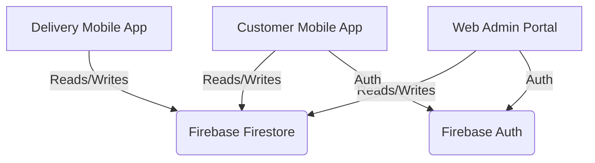

# 🍛 TadkaBox - Premium Food Ordering Solution

<div align="center">
  
  <br/>
  <h1><b>TadkaBox</b></h1>
  <p>
    <b>Delicious Food, Delivered Fast.</b>
    <br/>
    <i>A complete full-stack food ordering platform with Mobile App & Web Admin Portal.</i>
  </p>

  [](https://reactnative.dev/)
  [](https://expo.dev/)
  [](https://firebase.google.com/)
  [](https://reactjs.org/)
  [](https://tailwindcss.com/)

  <br/>
  <a href="#-features">Features</a> •
  <a href="#-tech-stack">Tech Stack</a> •
  <a href="#-getting-started">Getting Started</a> •
  <a href="#-screenshots">Screenshots</a> •
  <a href="#-author">Author</a>
</div>

---

## 🚀 Overview

**TadkaBox** is a state-of-the-art food ordering ecosystem designed to bridge the gap between hungry customers and delicious meals. It consists of two powerful components:

1.  **📱 Mobile Application (Android/iOS):** For customers to browse menus, place orders, track deliveries, and view history. Also includes interfaces for **Delivery Partners** to manage orders.
2.  **💻 Web Admin Portal:** A comprehensive dashboard for Restaurant Owners and Kitchen Staff to manage menus, track live orders, view analytics, and manage staff.

---

## ✨ Features

### 📱 Customer App (Mobile)
*   **Dynamic Menu:** Browse categories (Starters, Main Course, Desserts, etc.) with rich images and animations.
*   **Real-time Cart:** Seamless add-to-cart experience with animations.
*   **Live Order Tracking:** Track your food from "Preparing" to "Out for Delivery" to "Delivered".
*   **Order History:** View past orders with detailed summaries.
*   **Secure Checkout:** Integrated payment options (COD, UPI, Card).

### 🛵 Delivery Partner App (Mobile)
*   **Delivery Dashboard:** View available orders ready for pickup.
*   **Route Navigation:** Integrated maps to navigate to customer locations.
*   **OTP Verification:** Secure delivery completion using 4-digit OTPs.
*   **Earnings Tracker:** Real-time view of earnings per delivery.

### 👨‍🍳 Admin & Kitchen Portal (Web)
*   **Live Dashboard:** Real-time stats on Revenue, Orders, and Active Users.
*   **Menu Management:** Add, edit, or delete items with ease.
*   **Kitchen Display System (KDS):** dedicated view for chefs to see incoming orders instantly.
*   **Staff Management:** Manage roles and permissions for the team.
*   **Analytics:** Visual charts and graphs for business insights.

---

## � Tech Stack

| Component | Technology |
| :--- | :--- |
| **Mobile App** | React Native, Expo, Moti (Animations) |
| **Web Admin** | React.js, Vite, TailwindCSS, Recharts |
| **Backend** | Firebase (Firestore, Auth) |
| **State Mgmt** | React Context API |
| **Maps** | React Native Maps |
| **Icons** | Ionicons, Lucide React |

---

## 📸 Screenshots

<div align="center">
  <table>
    <tr>
      <td align="center"><b>Home Screen</b></td>
      <td align="center"><b>Menu & Cart</b></td>
      <td align="center"><b>Order Tracking</b></td>
    </tr>
    <tr>
      <td></td>
      <td></td>
      <td></td>
    </tr>
  </table>
</div>

> *Note: Replace the placeholder images above with actual screenshots of your app for the best look!*

---

## 🏁 Getting Started

### Prerequisites
*   Node.js (v18+)
*   npm or yarn
*   Expo Go (for mobile testing)

### Installation

1.  **Clone the repository**
    ```bash
    git clone https://github.com/AnuragWaskle/TadkaBox.git
    cd TadkaBox
    ```

2.  **Setup Mobile App**
    ```bash
    npm install
    npm start
    ```
    *Scan the QR code with Expo Go to run.*

3.  **Setup Web Admin**
    ```bash
    cd web-admin
    npm install
    npm run dev
    ```
    *Open `http://localhost:5173` in your browser.*

---

## 🏗 Architecture



---

## � Author

**Anurag Waskle**

*   **GitHub:** [@AnuragWaskle](https://github.com/AnuragWaskle)
*   **Project:** TadkaBox

---

<div align="center">
  Made with ❤️ by Anurag Waskle
</div>
