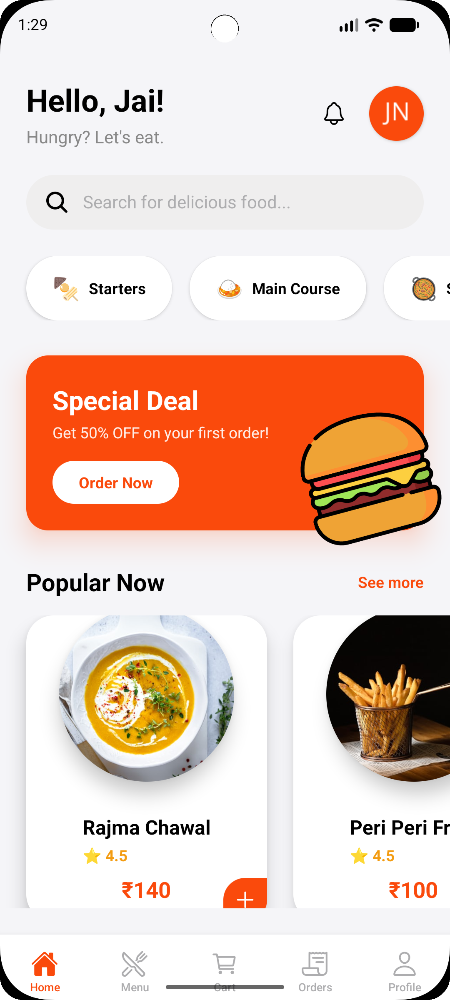
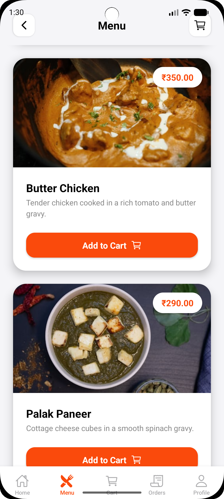
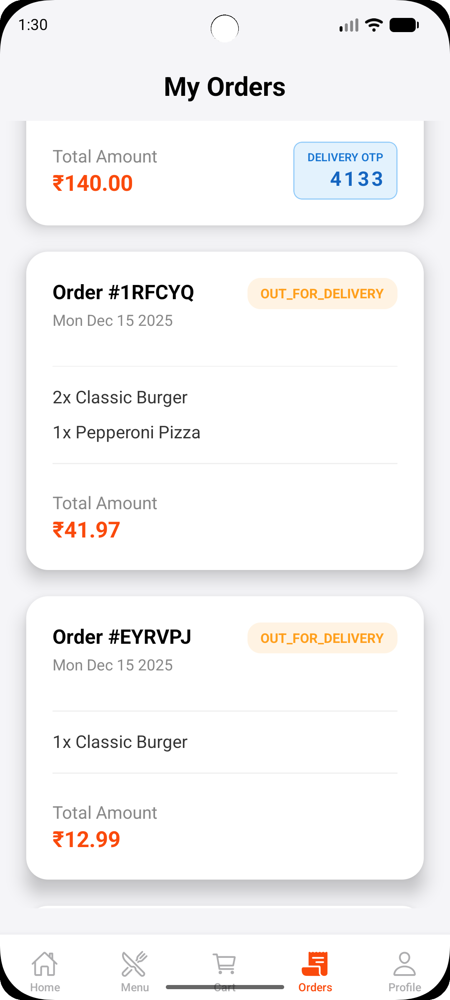
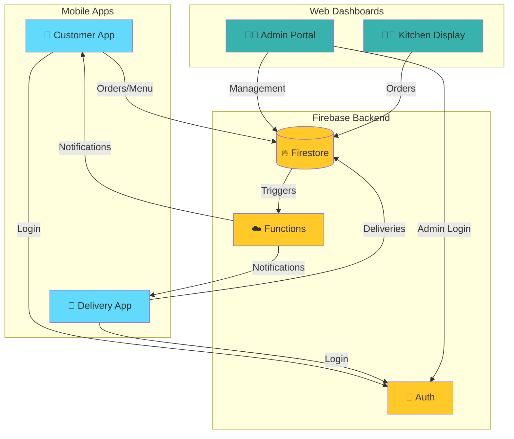

# 🍛 TadkaBox

<div align="center">
  
  
  ### Delicious Food, Delivered Fast ⚡
  
  *A complete full-stack food ordering ecosystem with Mobile App & Web Admin Portal*
  
  [](https://reactnative.dev/)
  [](https://expo.dev/)
  [](https://firebase.google.com/)
  [](https://reactjs.org/)
  [](https://tailwindcss.com/)
  
  [Features](#-key-features) • [Tech Stack](#-tech-stack) • [Screenshots](#-screenshots) • [Getting Started](#-getting-started) • [Architecture](#-architecture)
</div>

---

## 🌟 Overview

**TadkaBox** is a premium, production-ready food ordering platform that connects customers, restaurants, and delivery partners in a seamless ecosystem. Built with modern technologies and designed for scale.

<div align="center">
  
| 📱 Mobile Apps | 💻 Web Dashboards | 🔥 Real-time Sync |
|:---:|:---:|:---:|
| Customer & Delivery Partner | Admin & Kitchen Display | Firebase Powered |

</div>

---

## ✨ Key Features

<table>
<tr>
<td width="50%">

### 📱 **Customer Experience**
- 🎨 Beautiful, animated UI with smooth transitions
- 🍕 Dynamic menu with categories & search
- 🛒 Real-time cart with instant updates
- 📍 Live order tracking with status updates
- 💳 Multiple payment options (COD, UPI, Cards)
- 📜 Complete order history
- ⭐ Ratings & reviews system

</td>
<td width="50%">

### 🛵 **Delivery Partner Tools**
- 📊 Intuitive delivery dashboard
- 🗺️ Integrated maps & navigation
- 🔢 OTP-based secure delivery
- 💰 Real-time earnings tracker
- 📦 Order management system
- 🔔 Push notifications
- 📈 Performance analytics

</td>
</tr>
</table>

<table>
<tr>
<td width="50%">

### 👨‍💼 **Admin Portal (Web)**
- 📊 Comprehensive analytics dashboard
- 📈 Revenue & order statistics
- 🍔 Menu management (CRUD operations)
- 👥 User & staff management
- 🔐 Role-based access control
- 📱 Responsive design
- 📉 Visual charts & graphs
- 🔔 Real-time notifications

</td>
<td width="50%">

### 👨‍🍳 **Kitchen Display (Web)**
- 🔴 Live incoming orders
- ⏱️ Order preparation timers
- ✅ One-click status updates
- 🎯 Priority-based queue
- 📋 Order details at a glance
- 🔊 Audio alerts for new orders
- 📱 Tablet-optimized interface
- 🚀 High-performance rendering

</td>
</tr>
</table>

---

## 🛠 Tech Stack

<div align="center">

| Layer | Technologies |
|:---:|:---|
| **📱 Mobile** | React Native • Expo • Moti Animations • React Native Maps |
| **💻 Web** | React.js • Vite • TailwindCSS • Recharts • Lucide Icons |
| **🔥 Backend** | Firebase Firestore • Firebase Auth • Cloud Functions |
| **📦 State** | React Context API • Async Storage |
| **🎨 UI/UX** | Custom Components • Ionicons • Gradient Designs |

</div>

---

## 📸 Screenshots

### 📱 Mobile Application

<div align="center">
  <table>
    <tr>
      <td align="center"><b>🏠 Home Screen</b></td>
      <td align="center"><b>🍽️ Menu & Cart</b></td>
      <td align="center"><b>📍 Order Tracking</b></td>
    </tr>
    <tr>
      <td></td>
      <td></td>
      <td></td>
    </tr>
    <tr>
      <td align="center"><b>🛵 Delivery Dashboard</b></td>
      <td align="center"><b>📦 Order Details</b></td>
      <td align="center"><b>👤 Profile</b></td>
    </tr>
    <tr>
      <td></td>
      <td></td>
      <td></td>
    </tr>
  </table>
</div>

---

### 💻 Web Admin Portal

<div align="center">
  <table>
    <tr>
      <td align="center" colspan="2"><b>📊 Admin Dashboard</b></td>
    </tr>
    <tr>
      <td colspan="2"></td>
    </tr>
    <tr>
      <td align="center"><b>🍔 Menu Management</b></td>
      <td align="center"><b>📈 Analytics</b></td>
    </tr>
    <tr>
      <td></td>
      <td></td>
    </tr>
  </table>
</div>

---

### 👨‍🍳 Kitchen Display System

<div align="center">
  <table>
    <tr>
      <td align="center" colspan="2"><b>🔴 Live Kitchen Display</b></td>
    </tr>
    <tr>
      <td colspan="2"></td>
    </tr>
    <tr>
      <td align="center"><b>📋 Order Queue</b></td>
      <td align="center"><b>✅ Order Complete</b></td>
    </tr>
    <tr>
      <td></td>
      <td></td>
    </tr>
  </table>
</div>

> 💡 **Pro Tip:** Replace placeholder images with actual screenshots for the best presentation!

---

## 🏁 Getting Started

### 📋 Prerequisites

```bash
Node.js v18+
npm or yarn
Expo CLI (for mobile)
Firebase account
```

### 🚀 Installation

**1️⃣ Clone the Repository**
```bash
git clone https://github.com/AnuragWaskle/TadkaBox.git
cd TadkaBox
```

**2️⃣ Setup Mobile App**
```bash
# Install dependencies
npm install

# Start development server
npm start

# Scan QR code with Expo Go app
```

**3️⃣ Setup Web Admin Portal**
```bash
cd web-admin
npm install
npm run dev

# Open http://localhost:5173
```

**4️⃣ Configure Firebase**
```bash
# Create a Firebase project
# Add your config to:
# - mobile: firebase.config.js
# - web: web-admin/src/firebase.config.js
```

---

## 🏗 Architecture



---

## 📁 Project Structure

```
TadkaBox/
├── 📱 Mobile App/
│   ├── screens/          # All app screens
│   ├── components/       # Reusable components
│   ├── context/          # State management
│   ├── navigation/       # Navigation setup
│   └── assets/           # Images & icons
│
├── 💻 web-admin/
│   ├── src/
│   │   ├── components/   # React components
│   │   ├── pages/        # Dashboard pages
│   │   ├── contexts/     # Global state
│   │   └── utils/        # Helper functions
│   └── public/           # Static assets
│
└── 📄 Documentation
```

---

## 🎯 Roadmap

- [x] Core ordering system
- [x] Real-time tracking
- [x] Admin & Kitchen portals
- [ ] Payment gateway integration
- [ ] Push notifications
- [ ] AI-based recommendations
- [ ] Multi-restaurant support
- [ ] Loyalty programs

---

## 🤝 Contributing

Contributions are welcome! Feel free to open issues and pull requests.

1. Fork the repository
2. Create your feature branch (`git checkout -b feature/AmazingFeature`)
3. Commit changes (`git commit -m 'Add AmazingFeature'`)
4. Push to branch (`git push origin feature/AmazingFeature`)
5. Open a Pull Request

---

## 📄 License

This project is open source and available under the [MIT License](LICENSE).

---

## 👨‍💻 Author

<div align="center">
  
  **Anurag Waskle**
  
  [](https://github.com/AnuragWaskle)
  [](https://linkedin.com)
  [](https://yourportfolio.com)
  
</div>

---

<div align="center">
  
  ### ⭐ Star this repo if you find it helpful!
  
  Made with ❤️ and 🍛 by Anurag Waskle
  
  **TadkaBox** - *Bringing flavors to your fingertips*
  
</div>
